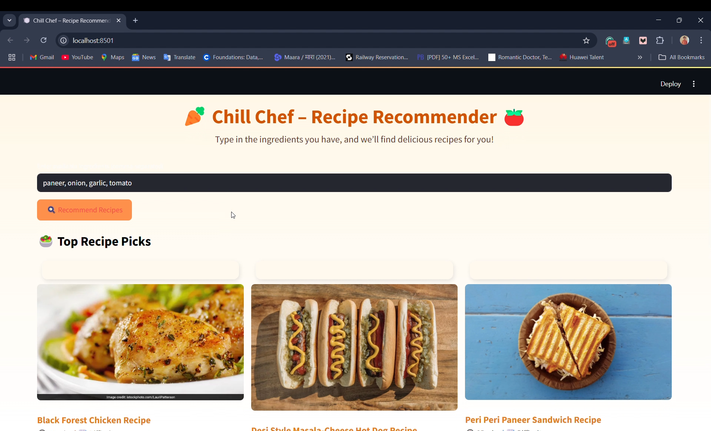

# Chill Chef

Chill Chef is a recipe recommendation system that suggests recipes based on the ingredients you have in your fridge. The project involves scraping recipe data from the web, storing it in a CSV file, and using NLP techniques to process the data for making accurate recommendations.

## Features

- **Recipe Data Scraping**: Scrape recipes from the web and store them in a CSV file.
- **Ingredient Processing**: Use NLP to process ingredients and recipe steps to find core ingredients.
- **Recipe Recommendations**: Convert ingredients to vectors and use cosine similarity to suggest recipes based on available ingredients.
- **Modular Design**: The project is modular, allowing easy updates and maintenance.

## Technology Stack

- **Programming Language**: Python
- **Notebook Environment**: Jupyter Notebook
- **Natural Language Processing (NLP)**: For processing ingredients and recipe steps
- **Similarity Algorithm**: Cosine Similarity

## Installation

1. Clone the repository:
    \`\`\`bash
    git clone [https://github.com/your-username/Chill-Chef.git](https://github.com/ShushantSharma372/Chill-Chef.git)
    cd ChillChef
    \`\`\`

2. Create and activate a virtual environment (optional but recommended):
    \`\`\`bash
    python3 -m venv venv
    source venv/bin/activate   # On Windows, use `venv\Scripts\activate`
    \`\`\`

3. Install the required dependencies:
    \`\`\`bash
    pip install -r requirements.txt
    \`\`\`

## Usage

1. Ensure the scraped recipe data is available in a CSV file within the project directory.

2. Open the Jupyter Notebook:
    \`\`\`bash
    jupyter notebook Model.ipynb
    \`\`\`

3. Run the cells in the notebook to load the data, process the ingredients, and get recipe recommendations based on the ingredients you have.

## Screenshots

### Recipe Recommendations

## Contributing

Contributions are welcome! Please fork the repository and create a pull request with your changes. Ensure that your code follows the project's coding standards and includes relevant tests.

## Acknowledgments

- [Jupyter](https://jupyter.org/) for providing the notebook environment.
- [NDTV Food](https://food.ndtv.com/) for inspiration and dataset sources.
